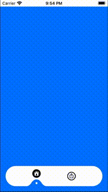

# FloatingTabView
[](https://swift.org)

[](https://github.com/apple/swift-package-manager)
[](https://developer.apple.com/xcode/swiftui/)

A custom TabView in SwiftUI



FloatingTabView is a very lightweight custom TabView in SwiftUI. 

The differences between it and the other Custom TabView are:

* FloatingTabView follows the standard TabView API. You can integrate it with very few lines of code:

* FloatingTabView is lightweight: it is written in less than 200 lines of code.


# Installation

## Requirements

* iOS 13.0+
* Xcode 11.0+

## Swift Package Manager (SPM)

You can simply install the framework using the following url to add the Swift Package

```
https://github.com/Gioevi90/FloatingTabView.git
```

Then you can import the framework using the command

```
import FloatingTabView
```

# How to use it

The code is really simple: you just have to embed you views into the FloatingTabViewItem passing the systemImage name you want to use to the initializer.

Here's a sample

```
import SwiftUI
import FloatingTabView

struct ContentView: View {
    var body: some View {
        FloatingTabView {
            FloatingTabViewItem(image: "house.circle") {
                Color.blue
            }
            FloatingTabViewItem(image: "square.and.arrow.up.circle") {
                ZStack {
                    Color.blue
                    Text("Fantastic share View")
                        .foregroundColor(.white)
                }
            }
        }
    }
}
```

# Future improvements

* Implement different styles
* Implement custom image support
* Implement Carthage support
* Implement CocoaPods support